# ML raw video technical overview

## Purpose

This documentation is an attempt to centralize *medium-level* technical information about **raw video recording** on [*Canon EOS* cameras](https://en.wikipedia.org/wiki/Canon_EOS) supported by [*Magic Lantern*](https://www.magiclantern.fm/) (shortened *ML* in this document).

By *medium-level*, we mean to provide information that are not specifically intended to a *developer* audience (no direct pointers to any *ML*-related codebase) nor *ML*'s high-level consumers (no direct pointers to *ML*'s menus or specific distribution) but that may be interesting for both groups to get better understanding about how the whole thing works.

> [!NOTE]
>
> Even if most of the information provided in this document *may be* agnostic enough regarding *Canon* camera models, it's possible some are only applicable to the specific model used for reference, being the [*Canon EOS 5D Mark III*](https://en.wikipedia.org/wiki/Canon_EOS_5D_Mark_III) (shortened *5D3*).

## Raw data

Video being basically a *sequence of images*, it's important to first focus on a single **image** produced by the camera.

*Canon EOS* cameras captures the incoming light rays entering the camera through the [lens](https://en.wikipedia.org/wiki/Camera_lens) using a [digital image sensor](https://en.wikipedia.org/wiki/Image_sensor).

This image sensor is itself composed of multiple **red**, **green** and **blue** (*[RGB](https://en.wikipedia.org/wiki/RGB_color_model)*) individual [photosensors](https://en.wikipedia.org/wiki/Photodetector), whose numerical data goes through a **filtering layer** used to distribute the *RGB* information on a specific **square grid** storage named a **color filter array** (*[CFA](https://en.wikipedia.org/wiki/Color_filter_array)*).

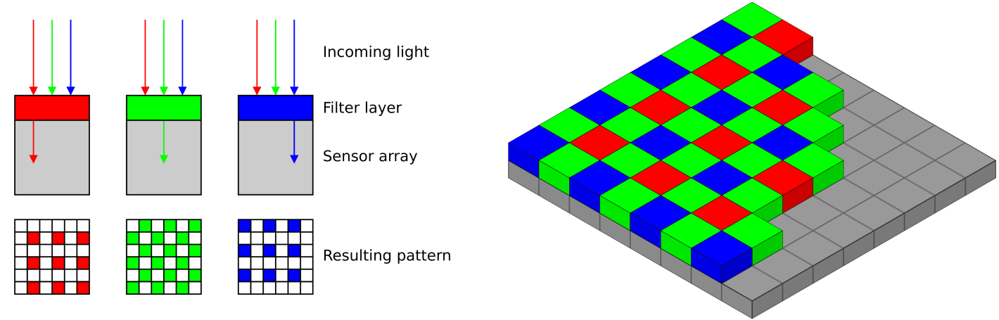

The specific storage pattern used on the *Canon EOS* cameras is the [Bayer filter mosaic](https://en.wikipedia.org/wiki/Bayer_filter), allowing to store one *half green*, one *quarter red* and one *quarter blue* values per *cell* (see below for the definition of a cell and related mathematics).

To illustrate this, imagine first the image sensor of the camera as a rectangle with a specific dimension, e.g.: *35mm* "[full-frame](https://en.wikipedia.org/wiki/Full-frame_DSLR)" on the *5D3*, being approximatively *36mm* horizontal and *24mm* vertical, the surface of this rectangle being fed with multiple *RGB* photosensors, e.g.: *5760 x 3840* on the *5D3* (*22.1184* millions sensors):

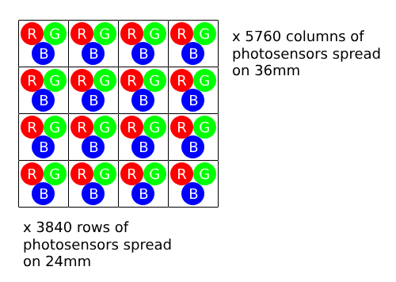

The *RGB* data acquired by the sensors goes then through the filtering layer to be stored following an organized *Bayer mosaic*: to do so, the photosensors *RGB* data on the rectangle surface are **grouped by four** following a ***2 x 2** pattern*, producing a ***2 x 2*** ***RG/GB*** space storage on the filtered mosaic (what's called previously a *cell*) where single **red** (*R*), **green** (*G*) and **blue** (*B*) information are organized the following way:

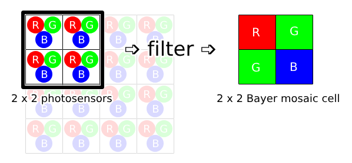

This is why it was said before the *red* and *blue* information represents *quarter* photosensors values (*single* individual *red* and *blue* storages on the mosaic being the averaging of *four* original *red* and *blue* sensor data respectively) when stored on the *Bayer* mosaic but the *green* information is *half* photosensor value (*two* *green* storages on the mosaic being the averaging of *four* original *green* sensor data).

After this filtering operation, the whole *Bayer* pattern looks like this:

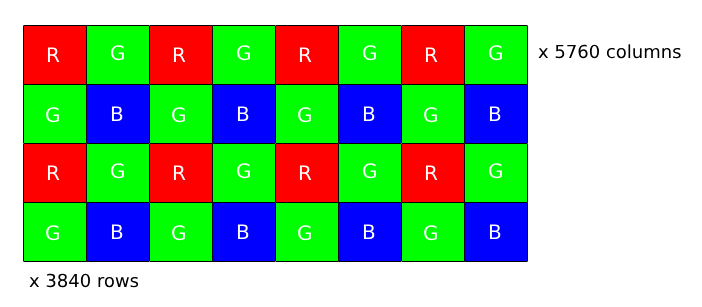

Each individual *red*, *green* and *blue* components in this *Bayer* pattern being encoded using an (*unsigned*) **14-bits** data numerical storage. 

> [!IMPORTANT]
>
> When we talk about **raw data** (image or video), we actually talk about this exact ***Bayer* pattern storage** content (or a *subset* of it with smaller horizontal and/or vertical dimensions), meaning basically here an array of *5760 x 3840 x 14-bits* data organized following this *RG/GB* 2x2 pattern in memory.

Because of this specific *RGGB cell* storage, a [demosaicing](https://en.wikipedia.org/wiki/Demosaicing) post-process (also commonly named ***debayering*** or *CFA interpolation* process) is required to **reconstruct the colors** of the final image in order to obtain a regular *5760 x 3840* image with three  regular *RGB* channels per *pixel* (still *14-bits* data range per channel) on which we can work with (manipulation, color-grading etc.).

Multiple *debayering* algorithms (e.g.: *AHD*, *AMaZE*...) are available and embedded in most photography and videography post-processing software, producing different visual reconstruction results.

## Raw images

The *standard* for storing these raw data as standalone images (with a bunch of related *meta-data*) is currently the ***DNG*** ([Digital Negative](https://en.wikipedia.org/wiki/Digital_Negative)) open-format developed by [*Adobe*](https://en.wikipedia.org/wiki/Adobe_Inc.), anyway *Canon* adopted on its-side a proprietary format being the ***CR2*** (*CR3* on most recent cameras).

This format is based over the [*TIFF/EP*](https://en.wikipedia.org/wiki/TIFF/EP) image standard, combined with a **lossless** variant of the [*Jpeg ITU-T81*](https://www.w3.org/Graphics/JPEG/itu-t81.pdf) (standard [*JPEG*](https://en.wikipedia.org/wiki/JPEG)*-LS* compression) algorithm named ***LJ92***.

> [!WARNING]
>
> In order to shutdown here potential useless discussions, we strongly emphases the fact that the *LJ92* compression algorithm used here is truly **<u>lossless</u>**, meaning the following chain of operation:
>
> ```
> [data-1] ➩ LJ92 compression stage ➩ [data-2] ➩ LJ92 de-compression stage ➩ [data-3]
> ```
>
> leads to "*data-3*" being **binary equivalent** to original "*data-1*" information (no loss at all of any information).

The advantages of the *LJ92* lossless algorithm being its native compatibility with the *JPEG* standard and its simplicity, allowing it to be implemented on embedded system with limited computational resources like a camera.

What's specifically good regarding camera's raw data is also its ability to compress data **without any color space conversion**, meaning in our case an exact conservation of the *RGGB* original *Bayer* pattern (no *YUV* conversion, see below).

The **efficiency** of the *LJ92* algorithm is variable, generally with a compression rate between *1.5:1* to *2:1*, depending of multiple factors that may lower it:

- high image complexity (*simple uniform areas* vs *highly detailed noisy regions*)
- high exposure, leading to more entropy in the data
- high sensor noise (*ISO gain*)
- high entropy on the data storage (e.g.: *14-bits* got way more entropy than *10-bits*)

For instance, we may expect a compression ratio between *1.7:1* to *1.9:1* when shooting a smooth scene with low *ISO* in *12-bits* depth but between *1.5:1* to *1.7:1* when shooting a detailed scene with high *ISO* in *14-bits*.

## Jpeg images

When *raw* is not needed (most of the time: to reduce storage space and/or because we do not perform extreme post-processing on the photography, but also to allow quick image review - hence a generally available *raw+jpeg* option), *Canon* cameras offers alternatively a regular **lossy JPEG** image format.

Saving an image using *Jpeg* on a *Canon* camera implies a [*YUV* color space conversion](https://en.wikipedia.org/wiki/Y%E2%80%B2UV), more specifically a *[YCbCr](https://en.wikipedia.org/wiki/YCbCr)* conversion, where colors are represented with one **luminance** component (*Y*) and two **chrominance** components (*Cb*: blue-difference, *Cr*: red-difference).

Because *YUV* color space is mostly based over the *luminance* perception by human eyes, the *chrominance* components *can be* degraded in order to reduce the storage space, the process being named [chroma subsampling](https://en.wikipedia.org/wiki/Chroma_subsampling).

Different ***chroma subsampling* schemes** are available, commonly expressed using a three-part ratio ***J\:a\:b***, where "*J*" is the horizontal sampling reference (usually 4), "*a*" the number of chrominance samples (*Cr*, *Cb*) in the first row of *J* pixels and "*b*" the number of changes of chrominance samples (*Cr*, *Cb*) between the first and second row of *J* pixels:

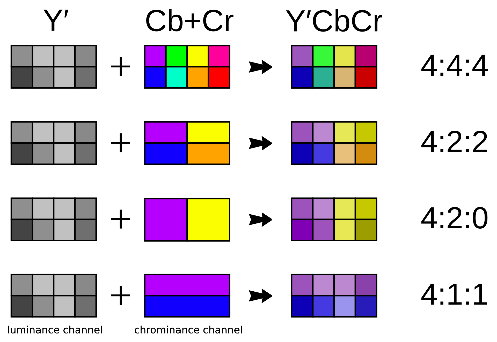

Typically, a "*4:4:4*" indicates there's no chroma subsampling performed (full resolution), while "*4:2:0*" indicates a chroma subsampling with a half horizontal and a half vertical resolution, the *5D3* relying on its side over a "***4:2:2***" chroma subsampling (half horizontal but full vertical resolution) when saving in *JPEG*.

When reading an image saved with this *Jpeg* format, software can re-compute three regular *red*, *green* and *blue* channels per pixel, with a maximum of *8-bits* of information per channel in our case, implying first a huge decimation of the original dynamic range from *14-bits* to *8-bits* then some color information loss due to the chroma sub-sampling process (as we're not dealing with a *4:4:4* scheme here).

Saving an image using a lossy *Jpeg* algorithm implies also some degradation of the image features themselves, due to the usage of a [discrete cosine transform](https://en.wikipedia.org/wiki/Discrete_cosine_transform) (*DCT*) producing more or less visible "*blocks*" of data depending of the "*quality*" parameter of the compression algorithm: on the *5D3*, two quality values are available ("*fine*", meaning a ~90% *JPEG* quality and "*normal*", meaning a ~75% *JPEG* quality).

| 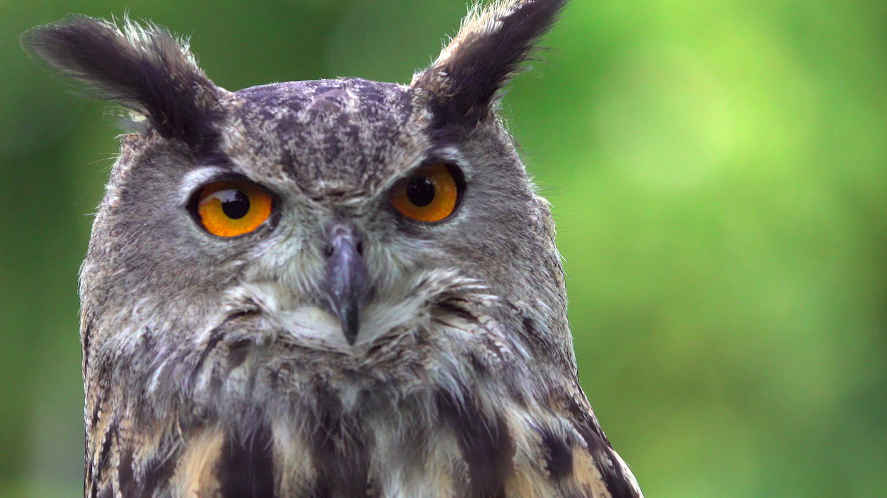 | 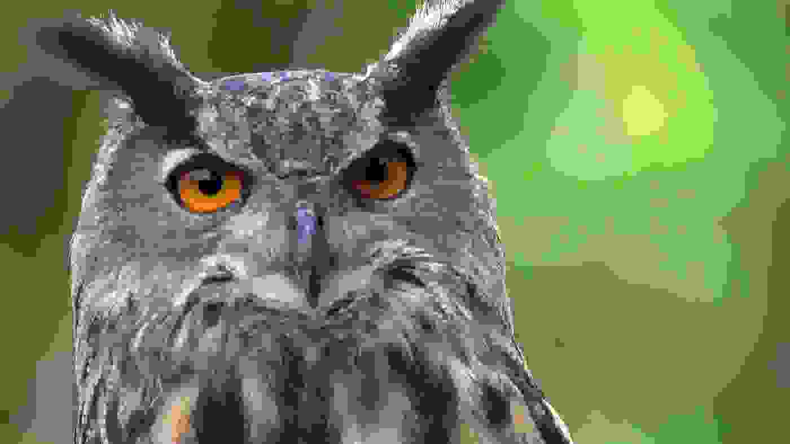 |
| ----------------------------------- | -------------------------------------------- |
| *original image*                    | *0% JPEG quality equivalent image*           |

Note also the *5D3* proposes another *Jpeg* attribute which is directly related to the saved image dimensions, implying a potential spatial resolution downscaling: "*Large*", to use to native image resolution (*5760 x 3840*), "*Medium*" to downscale it to *3840 x 2560* and "*Small*", to downscale it to *2880 x 1920*.

## Native video

Most *Canon* cameras proposes nowadays to natively deal with **videos**, at least in [Full HD](https://en.wikipedia.org/wiki/1080p) resolution (also name "***1080p***"), meaning a downscaled image resolution of *1920 x 1080* pixels compared to the raw data resolution.

These videos are saved using an [*Apple*'s *QuickTime* ***MOV***](https://en.wikipedia.org/wiki/QuickTime) file container mutexing one *video channel* compressed using the *[Advanced Video Coding](https://en.wikipedia.org/wiki/Advanced_Video_Coding)* (***AVC***, also known as ***H.264*** or *MPEG-4 part 10*) codec and one **uncompressed** *audio channel* ([linear pulse-code modulation](https://en.wikipedia.org/wiki/Pulse-code_modulation) - *LPCM*).

As for the *JPEG* algorithm used to deal with images, the *H.264* video compression algorithm implies a *YUV* **color space conversion** with a lossy **chroma subsampling** operation ("***4:2:0***" scheme internal, can be extended to a "*4:2:2*" scheme when using an *external HDMI recorder*) and also more generally a lossy encoding depending of the target **video bitrate**: *91 Mbps* using intra-frame compression option (*ALL-I*) or *30 Mbps* using inter-frame (*IPB*).

> [!NOTE]
>
> Some *Magic Lantern* options allows to crank up this target video bitrate using a multiplication factor, leading to a potential increase of video quality (but with some loss of recording stability).

## Picture profiles

Because lossy compressed video is more commonly used than raw in the wild, a common workaround strategy emerged in order to **increase the [dynamic range](https://en.wikipedia.org/wiki/Dynamic_range)** of the recording images without doing any change around the compression format itself: the use of **picture profiles**.

The principle is basically to apply some **mathematics transformation functions** on each *red*, *green* and *blue* channels of the image <u>**before**</u> the video compression stage in order to optimize the repartition of the channel's data information along its native storage range so it will thwart the decimation implied afterward by the compression algorithm.

The idea behind is that video compression algorithms tends by design to retain well *middle*-ranged values in the histogram (considered as *properly exposed*) but threshold *shadows* and *highlights*, considering them as less useful information perception-wide.

This is why the mathematical transformation functions applied over the input data is generally based over a [logarithmic scale](https://en.wikipedia.org/wiki/Logarithmic_scale) in order to *push* (or *compress*) the *shadows* (and with the lesser importance the *highlights*) information to the **center of the histogram**: considering the following *pseudo-logarithmic* mathematical representation, imagine mentally the horizontal axis is representing the natural linear progression of a channel (*input*) value between its minimum intensity value (left: *0*) to its maximum intensity value (right: *1*) then the vertical axis gives the related *output* value after applying the mathematical transformation (bottom: *0* - minimum intensity, top: *1* - maximum intensity), the *output* value information being itself sampled in the same data range than the *input* one (e.g.: *8-bits*).

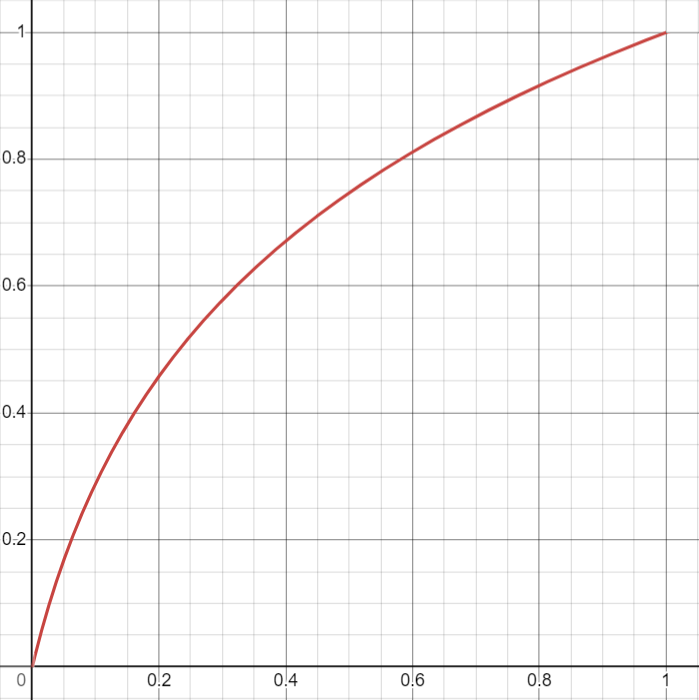

By doing this, the original dynamic range is *compressed* naturally to the middle of the histogram, implying a visually "*washed-out*" and darker image that will be **less subjected to compression algorithm loss** due to its centered histogram repartition:

|        | 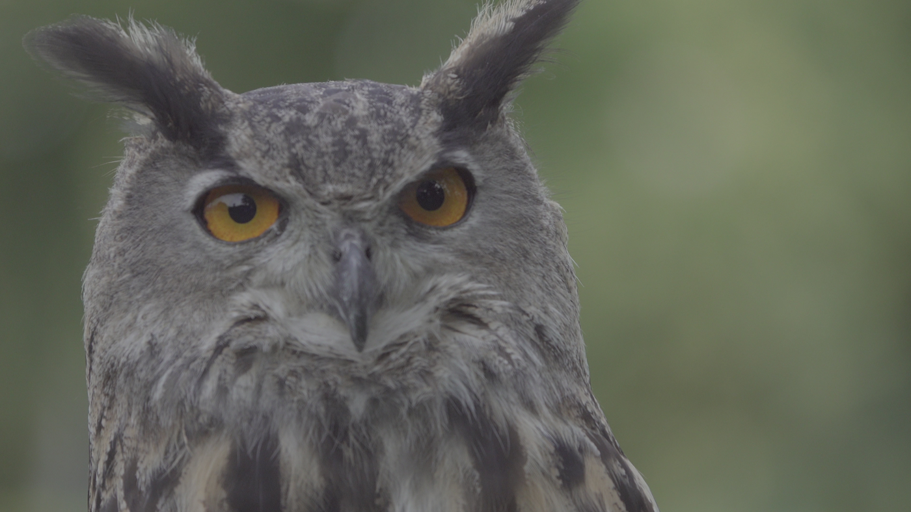             |
| ----------------------------------------- | -------------------------------------------- |
| 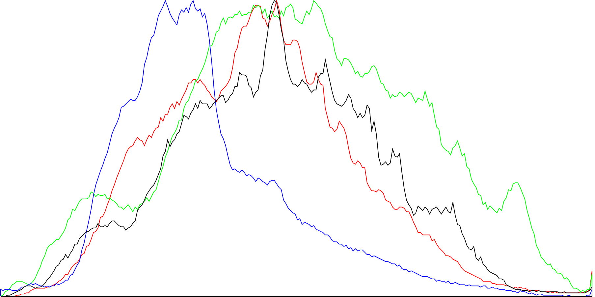 | 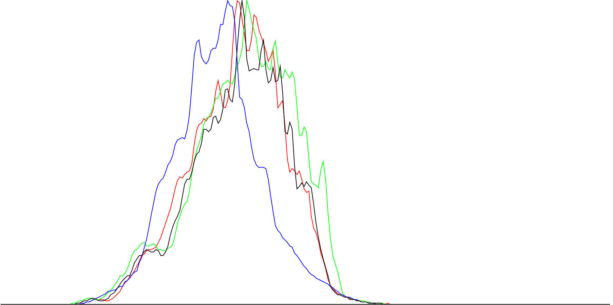       |
| original image with histogram             | image and histogram after applying log-curve |

Of course it means that we will need to apply another "*opposite*" [gamma curve](https://en.wikipedia.org/wiki/Gamma_correction) over the image after the video decompression (at [color grading](https://en.wikipedia.org/wiki/Color_grading) stage) in order to re-establish the **colors** and **contrasts** close to the originally captured image, this curve being generally a [sigmoid curve](https://en.wikipedia.org/wiki/Sigmoid_function) (or *s-curve*):

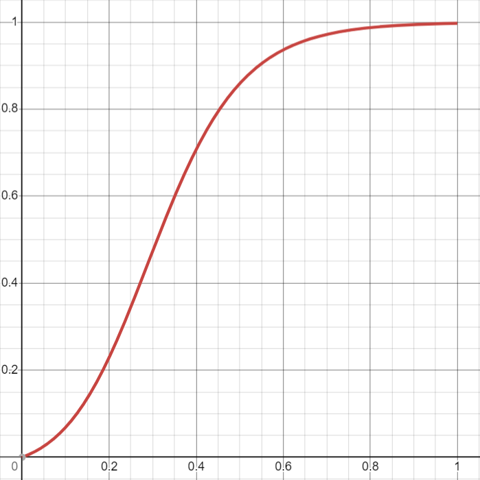

Applying this principles over the images when doing video recording greatly increases the dynamic range (generally expressed in *stops number*), notably around the *shadows* information:

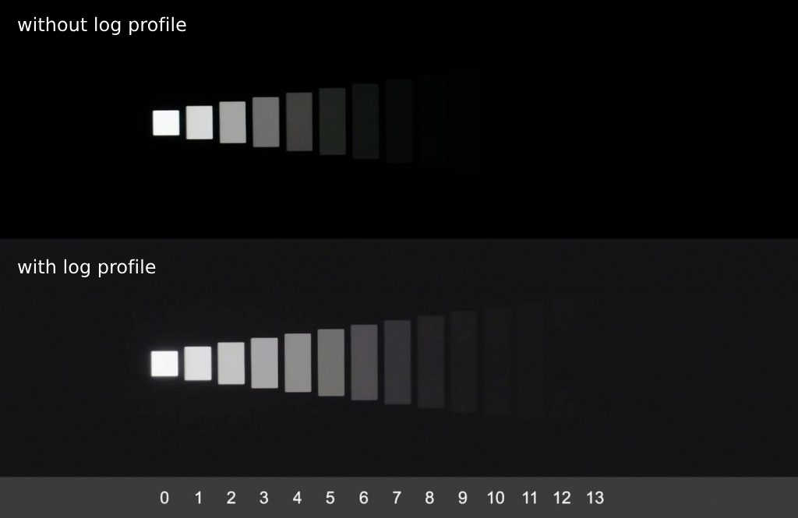

A lot of different [log profiles](https://en.wikipedia.org/wiki/Log_profile) are available to do this (and still continue to be developed by the industry), being generally the result of proprietary studies which are directly related a specific camera sensor model's [color science](https://en.wikipedia.org/wiki/Color_science#:~:text=Color%20science%20is%20the%20scientific,extension%20of%20traditional%20color%20theory.), each *red*, *green* and *blue* channels being computed independently using a specific transformation function to retain the maximum information possible while being compressed.

The *5D3* is natively able to handle **picture styles**, embedding some directly in the camera (*standard, portrait, landscape, neutral, faithful, monochrome*), allowing also to import external ones using the *PF2* file format.

A very common picture style used by the *Canon EOS* videographers community back in time was the free *Technicolor CineStyle* profile, that came with both the *PF2* file used for recording and a *s-curve* in multiple file formats to be applied by post-processing software to re-establish the image.

> [!NOTE]
>
> Even nowadays where raw video recording is more common, *log profiles* continue to be used by manufacturer, specifically when dealing with lossy compression algorithms over the raw data (e.g.: [*Black Magic BMRAW*](https://www.blackmagicdesign.com/fr/products/blackmagicraw)).

## Raw video

Some years ago, *ML*'s developers unlock the ability to **record raw video** on some *Canon*'s camera models.

It was a massive improvement as we're really talking about the direct recording of (*portions*) of the *Bayer* pattern itself (see below,  in *Raw images*) without any data loss (at least when not doing row or column *skipping*), not using any lossy frame compression technique, potentially in its native *14-bits* depth resolution.

The first implementations provides a custom video container to store the video frames, named the **MLV** file format, but because of the recording **bus bandwidth limitations** of the hardware (see later), it was initially just meant as a proof-of-concept and was barely usable (recording of only few frames then *stops*, or dealing with very low video [frame rates](https://en.wikipedia.org/wiki/Frame_rate)) and it seems impossible to be able to record the whole sensor surface (massive resolution of *5760 x 3840* x *14-bits*) at *24* frame-per-second (*fps*).

Later, multiple improvements where added to the raw video module :

- *crop modes*, which is the ability to focus only over a **sub-portion** of the native raw *Bayer* pattern, meaning less data to capture and record (video resolution compromise, then)

- row and/or column *skipping* and *binning* techniques, typically used in the badly-named "*anamorphic*" modes where the whole raw sensor buffer is used but some columns are *skipped* or *blended* together in order to reduce the amount of data to record in the end (requiring then some post-processing **data extrapolation**, similarly to traditional [anamorphic format](https://en.wikipedia.org/wiki/Anamorphic_format) horizontal *de-squeezing* process, hence the preset name)

- a systematic application of the ***LJ92* lossless compression algorithm** (see above) over the raw video frames in order to also reduce the amount of data recorded by the camera

- an optional decimation of the original *14-bits* depth data to *12* or *10-bits*, reducing drastically the entropy, increasing then the *LJ92* algorithm compression rate, leading to a great reduction of the amount of data to record

  > [!NOTE]
  >
  > Of course, this comes theoretically with a dynamic range reduction penalty, the decimation of the bit-depth being related to the *deep black* values of the histogram, but please note *12-bits* is generally extremely acceptable in real-life situations (well exposed shots with no extreme color-grading post-process implying a massive black values push-up), the decimated black values being generally related to noise information alone.

By combining these techniques, *ML* really made raw video recording a tangible reality.

## Bus bandwidth

As explained before, *ML* raw video module potentially unlocks the full ability to record the whole raw data sensor information without any loss (resolution, data bit-depth nor video frame rate compromise), the main limitation being the **camera bus bandwidth** used (after the *LJ92* compression stage) when we need to transfer the video frame data from the memory to the card (*MLV* file writing and flushing operation).

When video *Bayer* patterns are recorded by the camera and about to be stored on disk in the *MLV* format, they go temporarily through a record buffer that memorizes a certain amount of frames while doing the *LJ92* encoding and subsequent disk write operations: if these operations took too much time, the buffer becomes **saturated** then the camera **stops the recording** when reaching its buffering limit (buffer saturation is generally pictured on *ML* when recording data with a *green/orange/red* write indication).

Of course the write operations time is directly correlated to the dimensions and complexity of the captured images, but it also depends of the **camera hardware capabilities**, the current **transfer protocol speed** and the **write speed capabilities** of the card currently targeted: *CF* cards are faster than *SD* ones, anyway their inner speed capabilities is totally dependent of the card's *models* and *series*.

Currently, the only proper way to evaluate the maximum possible write capabilities of your camera and cards is to run the dedicated ***ML* speed benchmarks**:

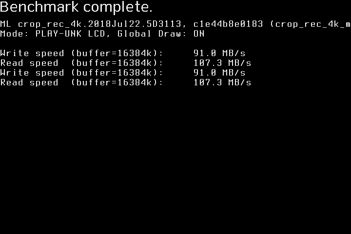

Once you know the write speed (*SD*, *CF* or both), you can use the following formula to approximatively know if your current **raw video settings** are compatibles with these *write speeds* (the result must be inferior of the write speed limit):

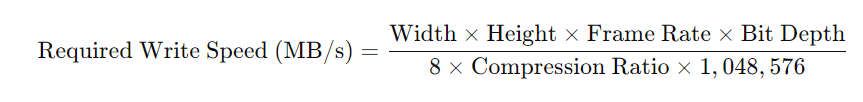

where:

- "*Width*" is the current **width** (in *pixel* unit) of the recorded video frames
- "*Height*" is the current **height** (in *pixel* unit) of the recorded video frames
- "*Frame Rate*" is the number of **frames per second** to target
- "*Bit Depth*" is the *Bayer* pattern **bit depth** (originally *14-bits*, but can be decimated)
- "*Compression Ratio*" is the *LJ92* **compression** algorithm that will reduce the size of the data: targeting a **1.6:1** ratio may be a good idea by default, as it's generally considered as a good average value with this algorithm

For example, if you want to record a *14-bits raw 4K 2.39:1 @23.976fps* video, you have then to compute:

```
( 3840 x 1606 x 23.976 x 14 ) / ( 8 x 1.6 x 1024 x 1024 )
= ~154 MBps (Megabyte per second)
```

Meaning that you need a constant write speed greater than approximatively *154 MBps* to get **continuous recording**.

It's approximatively possible (at least on a *5D3*) using some *workarounds* (see later), anyway it will remain very unstable, so it's better to remember what was explained before around the *LJ92* algorithm to ensure it will work better:

- *expose the scene well*, avoiding white saturation then more entropy (working against the compression algorithm)
- use low *ISO value* (typically: *100 ISO* if possible) to reduce the noise
- switch to *12-bits*, inducing a "*double-bonus*" regarding the *bit depth* reduction itself and an increase of the *LJ92* compression efficiency

By applying only these three actions, it's easy to go from a *~154 MBps* target to a *~124 MBps* (considering a *1.7:1* compression ratio) one, ensuring way more headroom around recording speed, implying a huge increase of stability.

Two **advanced workarounds** are also possible regarding the maximum possible bandwidth, using *ML*:

- an **overclock** of the *SD* transfer protocol, up to *160MHz*, *192MHz* or *240MHz* speeds depending of the *SD* card model (please refer to the [*240MHz* compatible cards list](https://wiki.magiclantern.fm/cards_240mhz)), leading to a huge increase of the *SD bus* write speed capabilities
- **card spanning** technique, allowing to alternate the write sequences between the *SD* and *CF* cards on camera with two buses (e.g.: *5D3*) in order to avoid buffers saturation

By cumulating both, a *5D3* is typically able to reach its **design storage bandwidth limit** of *~145 MBps*, unlocking *4K* recording capabilities.

## Post-processing

Of course, *ML* *raw* video recording comes with certain disadvantages we cannot ignore:

- the amount of tweaking required when using *ML* (*overclock*, *card spanning*, *specific exposure*, limited *resolution*/*frame rate*/*aspect ratio*...)
- the amount of **memory size** required on *SD* and/or *CD* cards to record the video sequences, and subsequently the amount of hard drive disk size required to store them
- the specific *MLV* format used requiring some more **post-processing** to be usable: a *[cDNG](https://en.wikipedia.org/wiki/CinemaDNG)* conversion to be properly ingested by all major video processing software, which is potentially not trivial when the video was recorded using *card spanning* technique, requiring to join multiple video segments together

*Cinema DNG* conversion can be performed using a *batch converter*, via the [*MLVApp* software](https://mlv.app/) or via the [*MLVFS* tool](https://www.magiclantern.fm/forum/index.php?topic=25473.0) (creating some kind of virtual drive doing live conversions of *MLV* to *DNG* files).

One common habit with *MLV* to reduce the data size amount and go back to a more comfortable workflow is to perform a pre-grade operation over the *MLV* in order to optimize the image features, then encode the video using a more regular high-end video format like [*Apple ProRes 444*](https://en.wikipedia.org/wiki/Apple_ProRes), using optionally the dedicated *[ML Log profile](https://www.magiclantern.fm/forum/index.php?topic=20710.0)* to increase the dynamic range (see before).